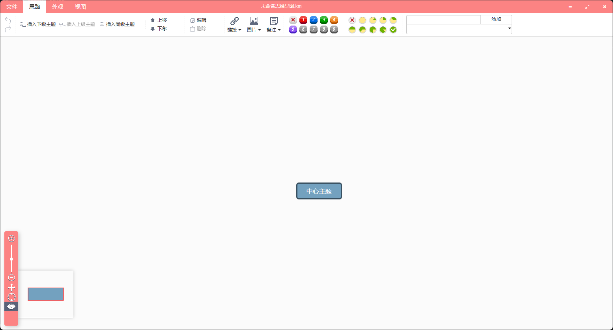
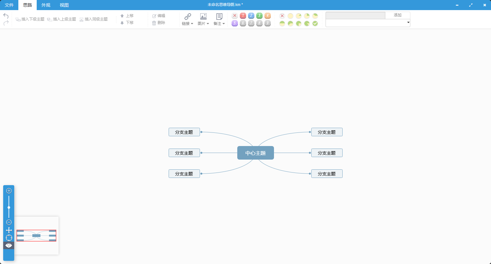
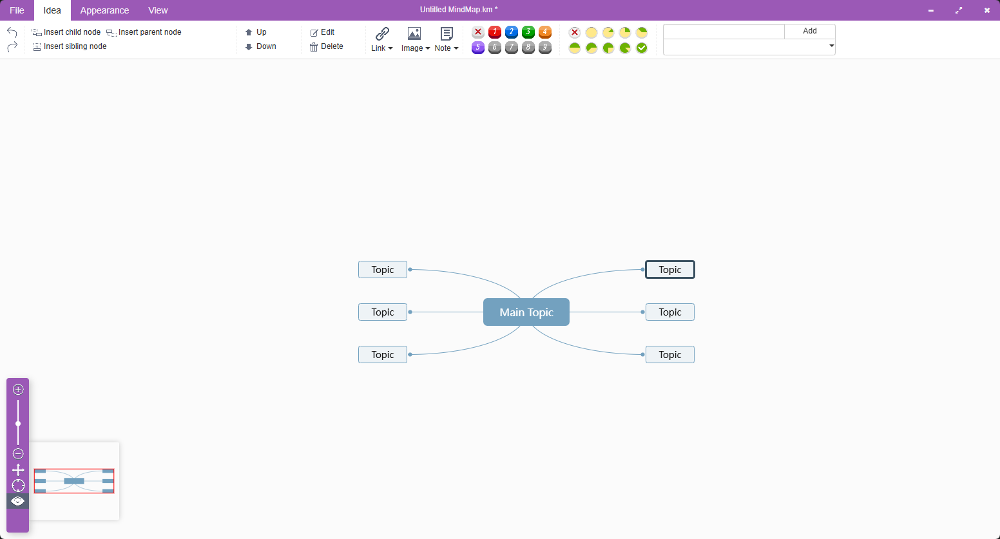

<p align="center">
  
</p>

<h1 align="center">TyMinder</h1>

<p align="center">
  一款强大、轻量、跨平台的思维导图桌面应用
</p>

<p align="center">
  <a href="https://github.com/ACtom/TyMinder/releases"></a>
  <a href="https://github.com/ACtom/TyMinder/blob/main/LICENSE"></a>
  <a href="https://github.com/ACtom/TyMinder/releases"></a>
</p>

<p align="center">
  简体中文 | <a href="README.md">English</a>
</p>

---

## 功能特性

- **跨平台** - 基于 Tauri 2 构建，支持 Windows、macOS 和 Linux
- **丰富编辑** - 节点操作（插入、删除、排序、归纳）、复制粘贴、撤销重做
- **样式控制** - 字体、加粗、斜体、颜色、样式拷贝粘贴
- **图标标记** - 优先级、进度指示器
- **备注功能** - 支持 Markdown 格式备注，实时预览
- **图片插入** - 支持本地图片和网络图片
- **多种布局** - 思维导图、树形、组织架构图等多种布局
- **主题切换** - 内置多种主题样式
- **快速搜索** - 在思维导图节点中快速搜索
- **自动备份** - 可配置间隔的自动备份功能

## AI 智能助手

- **多模型支持** - 支持 OpenAI、Claude、通义千问、DeepSeek 以及自定义模型
- **一键生成** - 输入主题，AI 自动生成完整的思维导图
- **智能对话** - 内置 AI 对话面板，随时获取灵感与解答
- **内容优化** - 支持节点内容的智能改写、扩写与润色

## 截图





## 安装

### 下载

从 [Releases](https://github.com/ACtom/TyMinder/releases) 下载最新安装包。

| 平台 | 下载格式 |
|------|----------|
| Windows | `.exe` (NSIS 安装程序) |
| macOS | `.dmg` |
| Linux | `.AppImage` / `.deb` |

### 文件关联

安装时会自动关联 `.km` 文件格式。

## 导入导出

### 支持的格式

| 格式 | 导入 | 导出 |
|------|:----:|:----:|
| JSON (`.km`) | ✅ | ✅ |
| Markdown | ✅ | ✅ |
| 纯文本 | ✅ | ✅ |
| FreeMind (`.mm`) | ✅ | ❌ |
| XMind (`.xmind`) | ✅ | ✅ |
| MindManager (`.mmap`) | ✅ | ❌ |
| PNG 图片 | ❌ | ✅ |
| SVG 矢量图 | ❌ | ✅ |

## 快捷键

| 操作 | 快捷键 |
|------|--------|
| 新建文件 | `Ctrl+N` |
| 打开文件 | `Ctrl+O` |
| 保存 | `Ctrl+S` |
| 另存为 | `Ctrl+Shift+S` |
| 撤销 | `Ctrl+Z` |
| 重做 | `Ctrl+Y` |
| 插入子节点 | `Tab` |
| 插入同级节点 | `Enter` |
| 删除节点 | `Delete` |
| 编辑节点 | `F2` / `空格` |
| 展开/折叠 | `Ctrl+/` |
| 搜索 | `Ctrl+F` |

## 支持语言

- 简体中文
- 繁體中文
- English (英语)
- Deutsch (德语)
- Français (法语)
- Español (西班牙语)
- Italiano (意大利语)

## 开发

### 环境要求

- [Node.js](https://nodejs.org/) (v16+)
- [Rust](https://www.rust-lang.org/) (Tauri 依赖)
- npm 或 pnpm

### 开发设置

```bash
# 克隆仓库
git clone https://github.com/ACtom/TyMinder.git
cd TyMinder

# 安装依赖
npm run init

# 启动 Tauri 开发模式
npm run tauri dev
```

### 构建

```bash
# 构建生产版本
npm run build

# 构建 Tauri 应用程序
npm run tauri build
```

## 技术栈

- **前端**: AngularJS, Bootstrap, [kityminder-core](https://github.com/fex-team/kityminder-core), [kityminder-editor](https://github.com/fex-team/kityminder-editor)
- **桌面端**: [Tauri 2](https://tauri.app/)

## 致谢

TyMinder 基于以下优秀的开源项目构建：

- [kityminder-core](https://github.com/fex-team/kityminder-core) - 百度 FEX 团队的思维导图核心引擎
- [kityminder-editor](https://github.com/fex-team/kityminder-editor) - 原始编辑器实现
- [Tauri](https://tauri.app/) - 跨平台桌面应用框架

## 许可证

[GPL-2.0](LICENSE)
